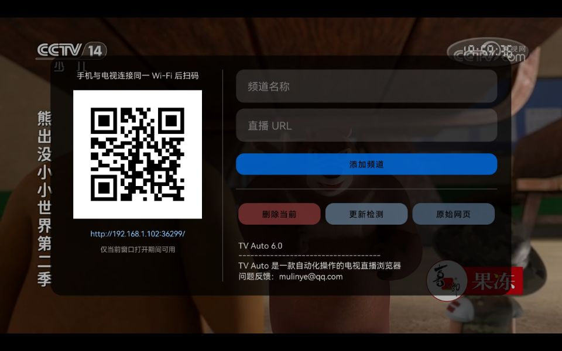
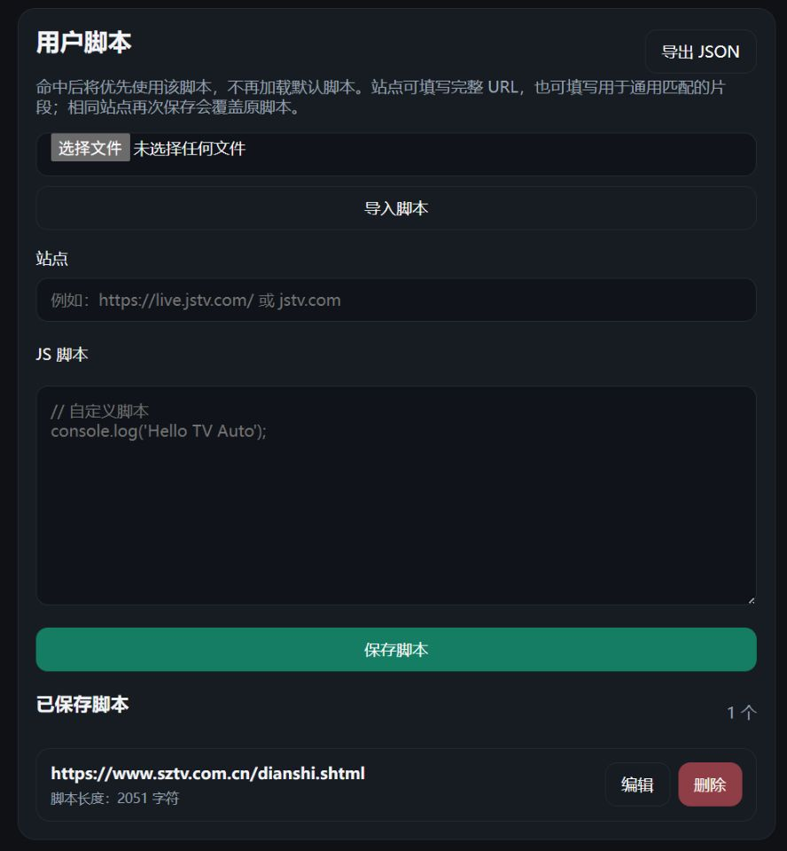
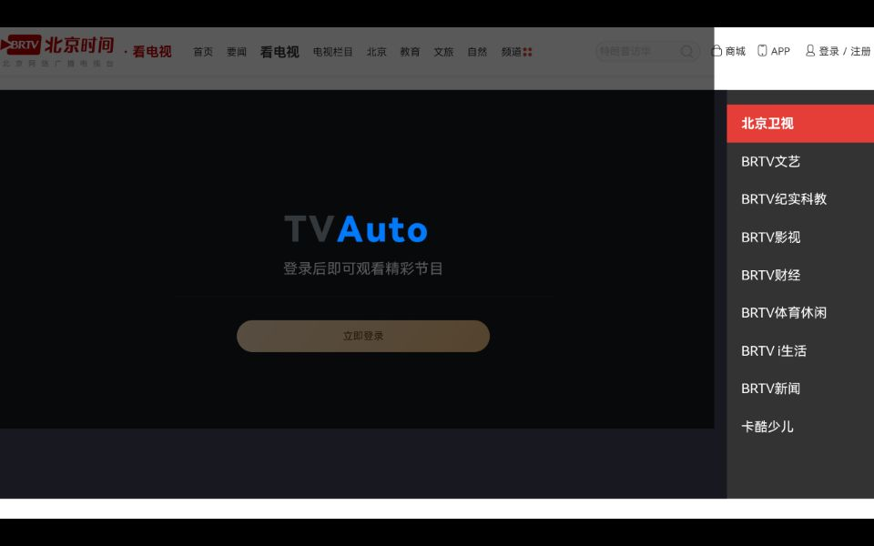
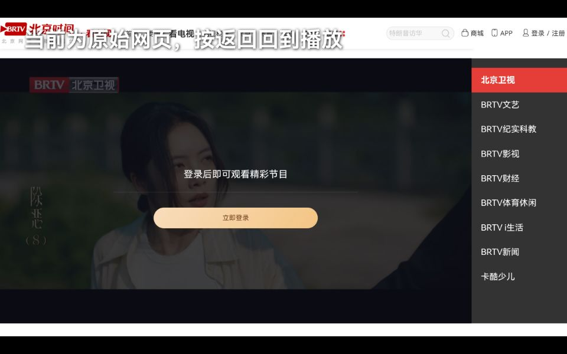

# TV Auto

TV Auto 是一款基于 WebView 的轻量级电视直播软件。它将网络直播网页整理为频道列表，在 Android TV、手机和平板上提供简单、沉浸的播放体验，并支持网页管理、用户脚本和原始网页模式。

当前版本：**v6.0**  
需要兼容老旧系统的设备，可查看 [TV Auto X5 分支](https://github.com/ymlyyy/TVAuto/tree/x5)。

---

## 核心能力

- 内置默认频道，安装后即可直接使用
- 支持遥控器和触摸屏
- 支持扫码或输入局域网地址进入网页管理页
- 支持频道新增、删除、恢复默认、清空、批量导入和导出
- 支持用户脚本，为不同站点提供独立适配能力
- 支持原始网页模式，便于处理登录、授权和特殊交互

---

## 使用方式

### 播放与切台

打开后会直接进入频道播放界面。


- 上 / 下键：切换频道
- 数字键：直接输入频道号
- OK / 右键：打开右侧频道列表


### 频道与脚本管理

按遥控器 **菜单键** 打开频道管理。



手机、平板或电脑与电视处于同一局域网时，都可以通过扫码或直接输入二维码下方地址进入网页管理页。该服务只在频道管理窗口打开期间启用，关闭窗口后会自动停止。


网页管理页支持：

- 新增、删除、恢复默认和清空频道
- 批量导入频道
- 导出当前频道列表为 `.txt`
- 检测更新
- 管理、导入和导出用户脚本

---

## 用户脚本

默认脚本已经可以处理一批常见页面，但它并不能覆盖所有站点。遇到结构特殊的页面，可以直接为该站点添加专属脚本。

下面这个页面中，默认脚本无法得到理想的接管效果：


在网页管理页中添加脚本时，站点既可以填写完整 URL，也可以填写域名或 URL 片段；当前页面命中后，会优先执行用户脚本，而不是默认脚本 (重启后生效)。




脚本生效后，同一站点可以按自己的规则重新适配：


用户脚本与频道列表独立保存，可单独导入或导出。示例脚本见 [`docs/examples/shenzhen-tv-script.js`](docs/examples/shenzhen-tv-script.js)。

---

## 原始网页模式

有些网站要求登录后才能观看。TV Auto 提供原始网页模式，让页面在需要时回到网站本来的样子。



进入方式：

- 全屏播放时连续按两次左键
- 或在频道管理窗口中点击 `原始网页`



> 原始网页模式更适合触屏或接入鼠标后使用。复杂网页通常不适合只靠遥控器完成操作。

---

## 数据格式

频道导入和导出均使用纯文本 `.txt`，每个频道以英文分号结尾：

```txt
"频道名称","频道地址";
```

示例：

```txt
"CCTV-1 综合","https://tv.cctv.com/live/cctv1/";"江苏卫视","https://live.jstv.com/";
```

导出的文件名会自动带上实际日期，便于备份和区分版本。完整示例见 [`docs/examples/channels.txt`](docs/examples/channels.txt)。

---

## 遥控器操作

| 按键 | 功能 |
| --- | --- |
| 上 / 下 | 切换上一频道 / 下一频道 |
| OK / 右 | 打开右侧频道列表 |
| 左 | 连续按两次进入原始网页模式 |
| 菜单 | 打开频道管理 |
| 数字键 | 直接输入频道号 |
| 返回 | 播放模式下双击退出；原始网页模式下返回播放 |

---

## v6.0 更新

- 新增局域网页面管理，可通过扫码或地址进入
- 新增频道新增、删除、恢复默认、清空、批量导入与导出
- 新增更新检测入口
- 新增用户脚本管理、导入和导出
- 新增原始网页模式
- 默认频道改为内置

---

## 使用须知

- 默认频道仅作示例用途，不保证长期可用，也不保证适用于所有地区
- 请自行核实并添加合规频道
- TV Auto 只负责整理和展示用户访问的网页内容，不提供直播内容本身
- 使用过程中请遵守当地法律法规

---

## 历史版本

### v5.0
- 全新设计界面

### v3.2
- 新增 Android TV 图标

### v3.1
- 修复深色模式
- 新增更新按键

### v3.0
- 新增长按屏幕隐藏 / 显示侧边按键
- 新增频道管理按钮
- 修复全屏播放时虚拟按键和导航条无法隐藏的问题

---

## 反馈与支持

如果你在使用中遇到问题，欢迎反馈。  
如果你觉得 TV Auto 对你有帮助，也欢迎支持作者继续维护。

<div align="center">
  
</div>
